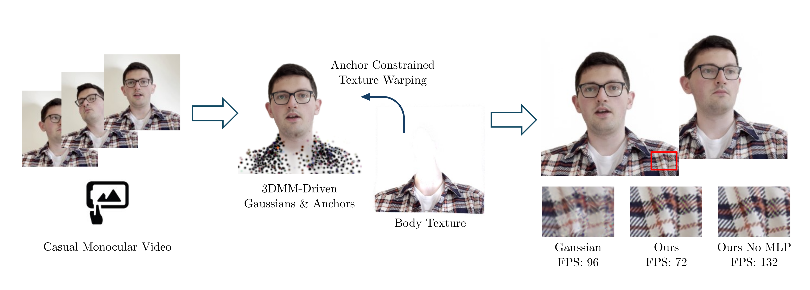

# Gaussian Head & Shoulders: High Fidelity Neural Upper Body Avatars with Anchor Gaussian Guided Texture Warping

## [Paper](https://arxiv.org/abs/2405.12069) | [Project Page](https://gaussian-head-shoulders.netlify.app/)

 

## Getting Started
* Clone this repo recursively: `git clone git@github.com:********.git --recursive`
* Create a conda or python environment and activate. For e.g., `conda create -n anchor_gaussian python=3.9.18; conda activate anchor_gaussian`.
* Install PyTorch 1.11.0 with conda or pip ([instructions](https://pytorch.org/get-started/previous-versions/)).
* Install PyTorch3d, we tested with 0.6.2, but any version should be fine
* Install other requirements: `pip install -r requirement.txt`
* Install Gaussian Splatting dependencies `pip install submodules/diff-gaussian-rasterization submodules/simple-knn`
* Download [FLAME model](https://flame.is.tue.mpg.de/download.php), choose **FLAME 2020** and unzip it, copy 'generic_model.pkl' into `./code/flame/FLAME2020`

## Preparing dataset
Our data format is the same as [IMavatar](https://github.com/zhengyuf/IMavatar/). 

Please download the subject 1 from PointAvatar at https://dataset.ait.ethz.ch/downloads/IMavatar_data/data/subject3.zip, rename `subject3` to `001` and then merge with `001.zip` in our released, which contains the additional DWposes needed to run our method. 


## Training and Testing

To train and evaluate both the MLP and distilled version:
```
cd code; bash train.sh
```

To run reenactment:

```
cd code; bash reenact.sh
```

## TODO List

- [x] Release training code
- [x] Release reenactment code
- [ ] Release data preprocess code